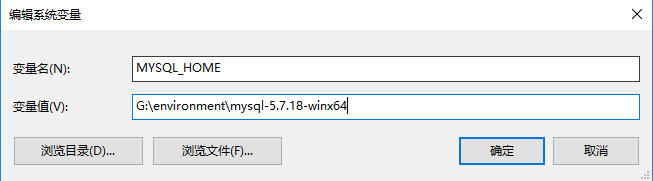
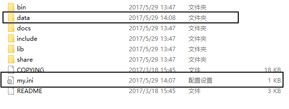
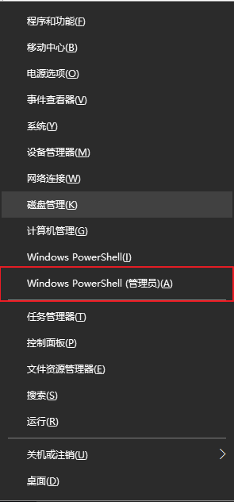
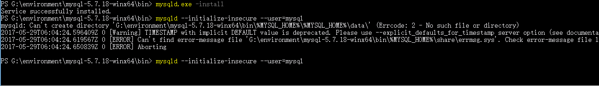
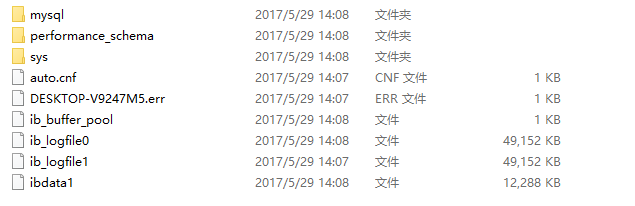
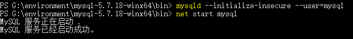
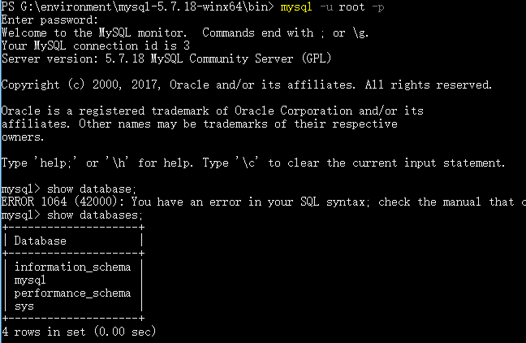

#	
mysql-5.7.18解压版安装

##	1.安装说明
操作系统：win10  
mysql版本：5.7.18  
下载地址： https://dev.mysql.com/downloads/mysql/  

##  2.下载解压配置环境变量
新增：
	
	MYSQL_HOME
如图：  

  

path中新增：

	%MYSQL_HOME%\bin

如图：  

##	3.在解压目录中新建my.ini文件
这个文件解压出来是没有的，需要自己创建。原先用的版本是5.6，那个版本是有这个文件的。
文件内容新加：
	
	[client]
	#端口号
	port=3306
	#默认字符编码
	default-character-set=utf8
	[mysqld]
	port=3306
	#默认的服务器编码
	character_set_server=utf8
	#这是mysql的解压目录，特别注意，原先我用的是环境变量中的
	#%MYSQL_HOME%来代替G:\environment\mysql-5.7.18-winx64，后面安装失败
	basedir=G:\environment\mysql-5.7.18-winx64
	#数据库存储位置，daba目录自己创建一下，我原先没有创建，它报错
	datadir=G:\environment\mysql-5.7.18-winx64\data
	[WinMySQLAdmin]
	%MYSQL_HOME%\bin\mysqld.exe
经过这一步后mysql目录下的结构为：

黑色标注的是我新加的文件夹和文件

##	4.执行安装
###	1) 以管理员权限打开控制台(终端)，不要直接输cmd，这是没有管理员权限的：

	使用win+x打开

###	2) 进入到解压目录中bin文件夹
执行：  

	 mysqld.exe -install
	 mysqld --initialize-insecure --user=mysql

执行第二部的时候报错了是因为我开始没有穿件data文件夹，后来创建了问题就解决了，执行完这一步就算安装成功了，这一步会在data下面生成数据库初始化的一些文件：

### 3)启动数据库服务

	 net start mysql

至此，mysql数据库安装成功。默认root是没有密码的。
	
	mysql -u root -p

回车，不用输入密码，直接登陆。  

	  

